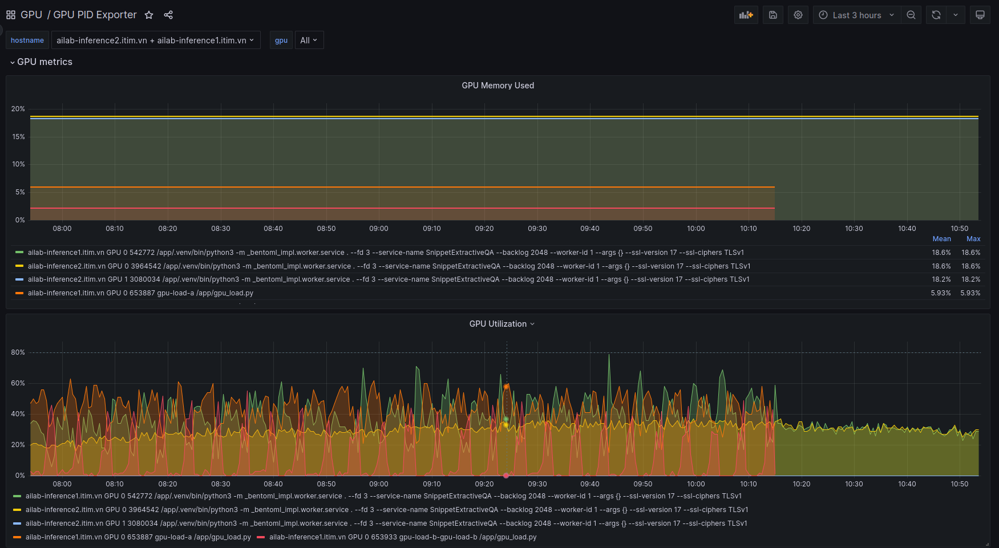

# GPUXRAY for Kubernetes

The intial idea of `gpuxray` was to designed for PID's GPU monitoring level. However, if you want to deploy it in Kubernetes environment and collect metrics is labeled by `pod`, that is some trick you could use to get the goal.

`gpuxray` is needed to run  on the host that is using GPU, you should choose `DaemonSet` for ensure that only one workload is setup in the node and use `hostPID: true` to indicate it will see process from host.

In some cases, when you deploy workload on GPU server by Kubernetes, it can be difficult to indicate 'which process a PID is related to' because several processes can have the same `comm` name like that:

```txt
+---------------------------------------------------------------------------------------+
| Processes:                                                                            |
|  GPU   GI   CI        PID   Type   Process name                            GPU Memory |
|        ID   ID                                                             Usage      |
|=======================================================================================|
|    0   N/A  N/A    520829      C   /app/.venv/bin/python3                      446MiB |
|    0   N/A  N/A    520928      C   /app/.venv/bin/python3                     1214MiB |
|    0   N/A  N/A   3357382      C   /app/.venv/bin/python3                     3818MiB |
+---------------------------------------------------------------------------------------+

```
In this case, we cannot recognize that `/app/.venv/bin/python3` is belong to which POD is running in this node, we only know that we have three pods are running in this node and use GPU resources. Therefore, naming for this process when run pod is important.

This problem could be fixed by adding identifiable text to the process name:

```bash
/bin/bash exec -a my_app_name <your command>
```
For example:

```bash
/bin/bash exec -a my_app_name /app/.venv/bin/python3 /app/.venv/bin/bentoml serve .
```

## Example Grafana dasboard
